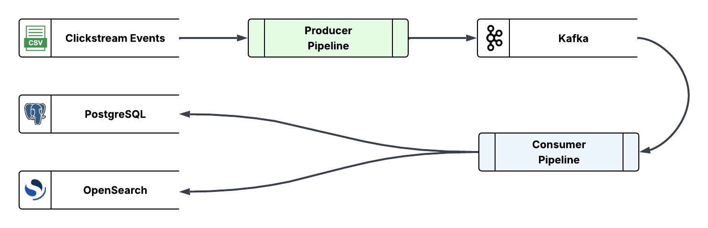
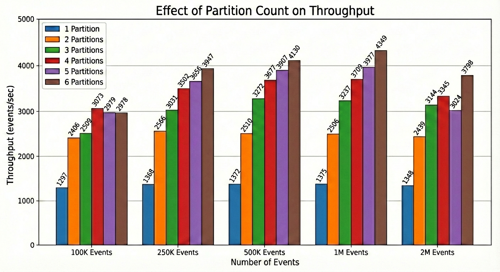

# Clickstream Data Processing Pipeline

A real-time clickstream data processing demo using **Kafka**, **PostgreSQL**, **Valkey**, and **OpenSearch** running on **Aiven** managed services. Supports multiple streaming frameworks including a lightweight kafka-python baseline, Quix Streams, Bytewax, and Mage AI. This project demonstrates how to build real-time data pipelines that process clickstream data for e-commerce analytics.

## Architecture

```
┌─────────────────────────────────────────────────────────────────────────────┐
│                         PORTS AND ADAPTERS ARCHITECTURE                     │
├─────────────────────────────────────────────────────────────────────────────┤
│  Framework Layer (STREAMING_IMPL)       Infrastructure Layer                │
│  ─────────────────────────────────      ─────────────────────────────────── │
│  ┌───────────────────────────────────────────┐  PostgreSQLEventRepository   │
│  │ default │  quix   │ bytewax │    mage     │  PostgreSQLSessionRepository │
│  │ (kafka- │ (Quix   │(Bytewax)│  (Mage AI   │  OpenSearchRepository        │
│  │ python) │ Streams)│         │  pipelines) │  ValkeySessionState          │
│  └───────────────────────────────────────────┘                                        │
│              │                                                              │
│              ▼                                                              │
│  Producer: CSV reader → Kafka → clickstream-events topic                    │
│                                                                             │
│  PostgreSQL Consumer: Kafka → events table + sessions table                 │
│                                                                             │
│  OpenSearch Consumer: Kafka → events index (optional)                       │
└─────────────────────────────────────────────────────────────────────────────┘
```

## Data Flow



## Streaming Frameworks

The pipeline supports multiple streaming framework implementations, selectable via the `STREAMING_IMPL` environment variable:

| Framework | `STREAMING_IMPL` | Description | Install |
|-----------|------------------|-------------|---------|
| **Default** | `default` | Lightweight kafka-python baseline | Base install |
| Quix Streams | `quix` | Production-ready stream processing with DataFrames | Base install |
| Bytewax | `bytewax` | Python streaming with Rust performance | `pip install -e ".[bytewax]"` |
| Mage AI | `mage` | Visual pipeline orchestration | `pip install -e ".[mage]"` |

### Default Framework (Recommended Starting Point)

The default framework uses raw `kafka-python` with no additional streaming dependencies. It's ideal for:
- Learning the codebase without framework complexity
- Environments where minimal dependencies are preferred
- Baseline performance comparisons

### Quix Streams

[Quix Streams](https://quix.io/docs/quix-streams/introduction.html) provides a Pythonic API for Kafka stream processing with:
- Streaming DataFrames with functional transformations
- Custom sinks for any data store
- Automatic consumer group management

### Bytewax

[Bytewax](https://bytewax.io/docs) is a Python-native stream processing framework with a Rust-based distributed engine:
- Dataflow API with operators like `map`, `filter`, `key_by`, and stateful operations
- Native Kafka connectors via `bytewax.connectors.kafka`
- Custom sinks using `DynamicSink` and `StatefulSinkPartition`
- Runs as a single Python process or distributed across workers

### Mage AI

[Mage AI](https://docs.mage.ai/) offers visual pipeline orchestration with:
- DAG-based pipeline definitions
- Built-in data loaders, transformers, and exporters
- Web UI for pipeline monitoring

### Switching Frameworks

Set `STREAMING_IMPL` in your `.env` file:

```bash
# Lightweight baseline (default)
STREAMING_IMPL=default

# Quix Streams
STREAMING_IMPL=quix

# Bytewax (requires extra install: pip install -e ".[bytewax]")
STREAMING_IMPL=bytewax

# Mage AI (requires extra install: pip install -e ".[mage]")
STREAMING_IMPL=mage
```

All frameworks share the same infrastructure layer (repositories, session state), ensuring consistent data handling regardless of framework choice.

## Prerequisites

- **Python 3.12** (required)
- **uv** ([install](https://docs.astral.sh/uv/)) or **pip**
- **Git**
- **Terraform** >= 1.5.7 and [Aiven](https://aiven.io/) account


## Quick Start

```bash
# Clone and setup
git clone https://github.com/tonypiazza/aiven-assignment.git
cd aiven-assignment
git pull

# Install dependencies (choose one)
uv venv && source .venv/bin/activate && uv sync && uv pip install -e .
# OR: python -m venv .venv && source .venv/bin/activate && pip install -e .

# Copy example and update terraform.tfvars with your Aiven credentials
cp terraform/terraform.tfvars.example terraform/terraform.tfvars

# Provision infrastructure
cd terraform && terraform init && terraform apply && cd ..

# Generate .env from Terraform outputs (auto-configures all services)
clickstream config generate

# Run pipelines
clickstream consumer start
clickstream producer start --limit 10000
clickstream consumer stop
clickstream status

# Cleanup
cd terraform && terraform destroy
```
> For local development with Docker, see: [local-docker.md](local-docker.md)


## CLI Reference

```bash
clickstream --help                        # Show all commands
clickstream status                        # Service health and counts
clickstream config show                   # Current configuration
clickstream config generate               # Generate .env from Terraform outputs

clickstream consumer start                # Start consumers (1 per partition)
clickstream consumer stop                 # Stop all consumers
clickstream consumer restart              # Restart consumers (e.g., after config change)

clickstream producer start                # Batch mode (fastest)
clickstream producer start --limit N      # First N events only
clickstream producer start --realtime     # Real-time replay (1x speed)
clickstream producer start --realtime 5x  # 5x faster than real-time
clickstream producer stop                 # Stop producer

clickstream data reset [-y]               # Reset all data stores
clickstream analytics [--json]            # Funnel metrics
clickstream benchmark [--limit N] [-y]    # Benchmark consumer throughput
clickstream opensearch init               # Import dashboards
```


## Project Structure

```
clickstream/
├── app.py                    # CLI entry point
├── consumer_runner.py        # PostgreSQL consumer process
├── opensearch_runner.py      # OpenSearch consumer process
├── producer_runner.py        # Kafka producer process
├── base/                     # Abstract base classes (ports)
│   ├── repositories.py       # EventRepository, SessionRepository, SearchRepository
│   └── ...
├── core/                     # Domain logic
│   ├── models.py             # Event, Session domain models
│   └── session_processor.py  # Session aggregation logic
├── framework/                # Streaming framework implementations
│   ├── __init__.py           # get_framework() factory
│   ├── base.py               # StreamingFramework ABC
│   ├── default/              # kafka-python baseline (no extra dependencies)
│   │   ├── producer.py       # CSV → Kafka producer
│   │   ├── postgresql_consumer.py
│   │   └── opensearch_consumer.py
│   ├── quix/                 # Quix Streams implementation
│   │   ├── producer.py
│   │   ├── postgresql_consumer.py
│   │   ├── opensearch_consumer.py
│   │   └── sinks/            # Quix BatchingSink adapters
│   ├── bytewax/              # Bytewax implementation
│   │   ├── producer.py
│   │   ├── postgresql_consumer.py
│   │   ├── opensearch_consumer.py
│   │   └── sinks/            # Bytewax DynamicSink adapters
│   └── mage/                 # Mage AI pipelines
│       ├── data_loaders/     # Kafka/CSV sources
│       ├── transformers/     # Event/session transforms
│       ├── data_exporters/   # PostgreSQL/OpenSearch sinks
│       └── pipelines/        # Pipeline definitions
├── infrastructure/           # Shared infrastructure (adapters)
│   ├── repositories/
│   │   └── postgresql.py     # PostgreSQLEventRepository, PostgreSQLSessionRepository
│   ├── search/
│   │   └── opensearch.py     # OpenSearchRepository
│   ├── cache/
│   │   └── valkey.py         # ValkeyCache
│   └── kafka.py              # Kafka utilities
├── cli/                      # CLI commands
└── utils/                    # Shared utilities
    ├── config.py             # Pydantic settings
    ├── session_state.py      # Valkey session management
    └── ...
```

## Key Design Decisions

### Pluggable Producer and Consumer Architecture

The project uses a **modular architecture** with separate producer and consumer implementations that can be mixed and matched:

```python
from clickstream.producers import get_producer
from clickstream.consumers import get_consumer

# Get producer (controlled by PRODUCER_IMPL env var)
producer = get_producer()  # Returns KafkaPythonProducer or QuixProducer
producer.run(limit=1000)

# Get consumer (controlled by CONSUMER_IMPL env var)
consumer = get_consumer("postgresql")  # Returns implementation-specific consumer
consumer.run()
```

**Available implementations:**
- **Producer**: `kafka_python` (default), `quix`
- **Consumer**: `kafka_python` (default), `quix`, `mage`, `bytewax`

This separation allows you to:
- Use different implementations for producing vs consuming
- Compare performance across implementations
- Choose the right tool for your environment
- Add new implementations without changing application code

### Valkey for Session State

Session state is stored in Valkey (Redis-compatible) rather than framework-specific state stores:
- External state remains visible via `clickstream status` command
- No data loss on consumer restart
- Preserves existing batch operations and retry logic
- Works seamlessly with Aiven Valkey
- Consistent behavior across all frameworks

### Shared Infrastructure (Ports and Adapters)

The project uses a **Ports and Adapters** (Hexagonal) architecture for persistence:

**Infrastructure Repositories** (shared by all frameworks):
- `PostgreSQLEventRepository` - Bulk inserts with `ON CONFLICT DO NOTHING`
- `PostgreSQLSessionRepository` - Complex upserts with array merging
- `OpenSearchRepository` - Bulk indexing with document ID-based deduplication

**Framework-Specific Adapters** (thin wrappers):
- Default: Direct repository calls from kafka-python consumers
- Quix: `BatchingSink` adapters that wrap repositories
- Mage: Data exporters that wrap repositories

This separation allows the infrastructure layer to be reused across all streaming frameworks while keeping framework-specific concerns isolated.

### Session Batching (Per Commit)

Sessions are accumulated during event processing and flushed to PostgreSQL when Kafka offsets are committed. This provides:
- Efficient batching (not writing on every event)
- Consistency with Kafka offset commits
- Same behavior across all framework implementations


## Data Model

### Events

The included `data/events.csv` contains ~2.7M clickstream events which includes a small percentage of duplicates.

| Column | Type | Description |
|--------|------|-------------|
| `timestamp` | Unix ms | Event timestamp |
| `visitorid` | Integer | Unique visitor identifier |
| `event` | Enum | `view`, `addtocart`, or `transaction` |
| `itemid` | Integer | Product identifier |
| `transactionid` | Integer | Transaction ID (nullable) |

### Sessions

Sessions are aggregated from events using a configurable timeout:

| Column | Type | Description |
|--------|------|-------------|
| `session_id` | VARCHAR | Unique session identifier |
| `visitor_id` | BIGINT | Visitor identifier |
| `session_start` | TIMESTAMPTZ | Session start time |
| `session_end` | TIMESTAMPTZ | Session end time |
| `duration_seconds` | INTEGER | Session duration |
| `event_count` | INTEGER | Total events |
| `view_count` | INTEGER | Number of views |
| `cart_count` | INTEGER | Add-to-cart count |
| `transaction_count` | INTEGER | Transaction count |
| `items_viewed` | BIGINT[] | Viewed item IDs |
| `items_carted` | BIGINT[] | Carted item IDs |
| `items_purchased` | BIGINT[] | Purchased item IDs |
| `converted` | BOOLEAN | Had a transaction |


## Kafka Partitioning

Kafka partitioning involves several key tradeoffs:

- **Choosing the right partition count** - Too few partitions limits parallelism and throughput; too many increases broker overhead, memory usage, and end-to-end latency. Once created, increasing partitions is possible but decreasing is not (requires topic recreation).
- **Partition key selection** - The partition key determines which partition receives each message. Poor key selection can lead to "hot partitions" where one partition receives disproportionate traffic.
- **Ordering guarantees** - Kafka only guarantees message ordering within a single partition. If strict global ordering is required, you're limited to a single partition.
- **Consumer group rebalancing** - When consumers join or leave a group, partitions are reassigned, causing temporary processing delays.

For more information, use the following Aiven documentation links:
- [Partition Segments](https://aiven.io/docs/products/kafka/concepts/partition-segments)
- [Create Kafka Topics](https://aiven.io/docs/products/kafka/howto/create-topic)
- [Get Partition Details](https://aiven.io/docs/products/kafka/howto/get-topic-partition-details)



The above chart shows that throughput scales with the number of Kafka partitions, as each partition is consumed by a dedicated consumer process. Benchmarks show gains up to 4 partitions, with diminishing returns as the volume of incoming data grows. To change partition count, set `kafka_events_topic_partitions` in `terraform/terraform.tfvars`, then apply:

```bash
cd terraform && terraform apply && cd ..
```

Run your own benchmarks with:

```bash
clickstream benchmark
```
This command can be useful for understanding the impact of both partitioning and replication on performance.


## OpenSearch (Optional)

OpenSearch is disabled by default. The OpenSearch consumer uses a separate Kafka consumer group (`clickstream-opensearch`), which enables **automatic backfill**: if you enable OpenSearch after events have already been consumed, the OpenSearch consumer will automatically read from the beginning of the topic and index all events.

### Enable OpenSearch

OpenSearch is not provisioned by default. To enable:

1. Set in `terraform/terraform.tfvars`:
   ```hcl
   opensearch_enabled = true
   ```

2. Apply the changes:
   ```bash
   cd terraform && terraform apply && cd ..
   ```

3. Regenerate `.env` to include OpenSearch credentials:
   ```bash
   clickstream config generate -f
   ```

4. Restart consumer:
   ```bash
   clickstream consumer restart
   ```

### Access Dashboards

First, initialize the dashboards:

```bash
clickstream opensearch init
```

The output should look like:

```
  Initializing OpenSearch
  ✓ OpenSearch is reachable
  ✓ Index 'clickstream-events' exists (99,987 documents)
  ✓ Imported index pattern: clickstream-events*
  ✓ Imported 5 visualizations
  ✓ Imported 2 dashboards

  Open dashboards at https://<your-opensearch-host>
```

Use the link to open the OpenSearch Dashboards web UI. The URL will be your Aiven OpenSearch service URL.

**NOTE**: When prompted for tenant, select **Global**.


## Cleanup

```bash
cd terraform && terraform destroy
```


## References

### Streaming Frameworks
- [kafka-python Documentation](https://kafka-python.readthedocs.io/)
- [Quix Streams Documentation](https://quix.io/docs/quix-streams/introduction.html)
- [Bytewax Documentation](https://bytewax.io/docs)
- [Mage AI Documentation](https://docs.mage.ai/)

### Infrastructure
- [Aiven Documentation](https://aiven.io/docs)
- [Apache Kafka Documentation](https://kafka.apache.org/documentation/)
- [PostgreSQL Documentation](https://www.postgresql.org/docs/)
- [OpenSearch Documentation](https://docs.opensearch.org/latest/)

## License

MIT
